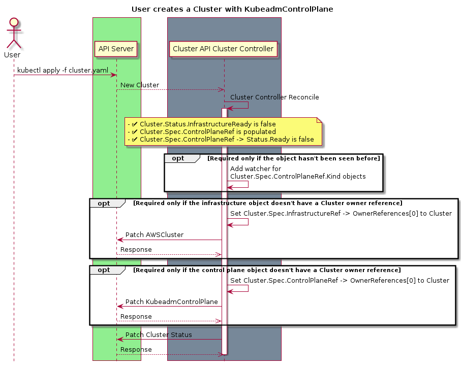
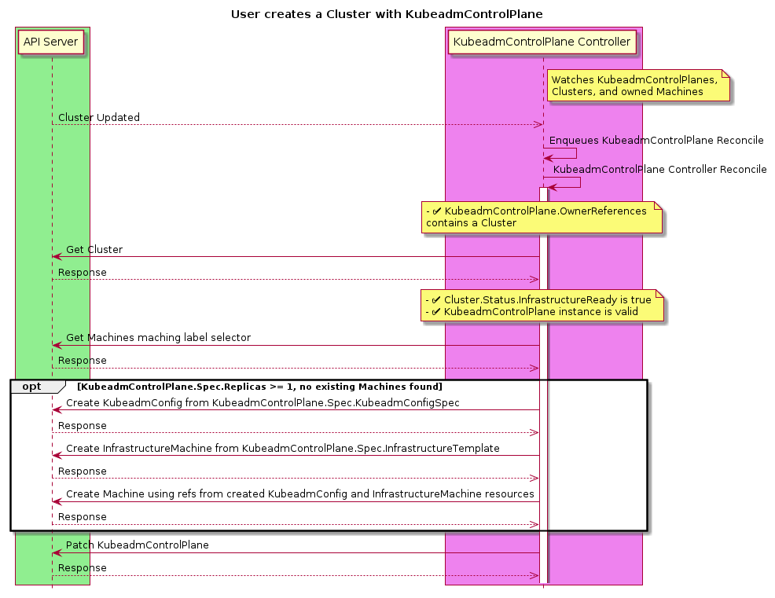
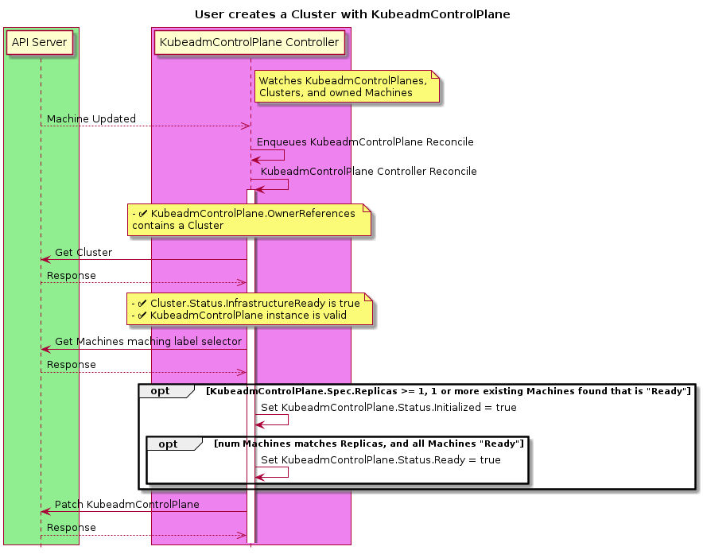
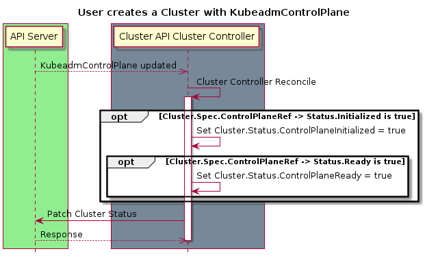
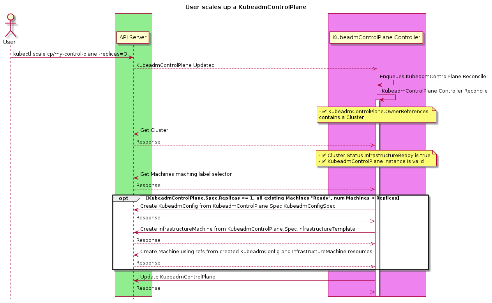

# Control Plane Management

## Table of Contents

- [Control Plane Management](#control-plane-management)
  - [Table of Contents](#table-of-contents)
  - [Glossary](#glossary)
    - [References](#references)
  - [Summary](#summary)
  - [Motivation](#motivation)
    - [Goals](#goals)
      - [Additional goals of the default kubeadm machine-based Implementation](#additional-goals-of-the-default-kubeadm-machine-based-implementation)
    - [Non-Goals / Future Work](#non-goals--future-work)
  - [Proposal](#proposal)
    - [User Stories](#user-stories)
      - [Identified features from user stories](#identified-features-from-user-stories)
    - [Implementation Details/Notes/Constraints](#implementation-detailsnotesconstraints)
      - [New API Types](#new-api-types)
      - [Modifications required to existing API Types](#modifications-required-to-existing-api-types)
      - [Behavioral Changes from v1alpha2](#behavioral-changes-from-v1alpha2)
      - [Behaviors](#behaviors)
        - [Create](#create)
        - [Scale Up](#scale-up)
        - [Scale Down](#scale-down)
        - [Delete of the entire ControlPlane (kubectl delete controlplane my-controlplane)](#delete-of-the-entire-controlplane-kubectl-delete-controlplane-my-controlplane)
        - [Cluster upgrade (using create-swap-and-delete)](#cluster-upgrade-using-create-swap-and-delete)
        - [Control plane healthcheck](#control-plane-healthcheck)
        - [Adoption of pre-v1alpha3 Control Plane Machines](#adoption-of-pre-v1alpha3-control-plane-machines)
      - [Code organization](#code-organization)
    - [Risks and Mitigations](#risks-and-mitigations)
      - [etcd membership](#etcd-membership)
  - [Design Details](#design-details)
    - [Test Plan](#test-plan)
    - [Graduation Criteria](#graduation-criteria)
      - [Alpha -> Beta Graduation](#alpha---beta-graduation)
    - [Upgrade Strategy](#upgrade-strategy)
  - [Alternatives](#alternatives)
  - [Implementation History](#implementation-history)

## Glossary

The lexicon used in this document is described in more detail [here](https://github.com/kubernetes-sigs/cluster-api/blob/master/docs/book/src/reference/glossary.md).  Any discrepancies should be rectified in the main Cluster API glossary.

### References

[Kubernetes Control Plane Management Overview](https://docs.google.com/document/d/1nlWKEr9OP3IeZO5W2cMd3A55ZXLOXcnc6dFu0K9_bms/edit#)

## Summary

This proposal outlines a new process for Cluster API to manage control plane machines as a single concept. This includes
upgrading, scaling up, and modifying the underlying image (e.g. AMI) of the control plane machines.

The control plane covered by this document is defined as the Kubernetes API server, scheduler, controller manager, DNS
and proxy services, and the underlying etcd data store.

## Motivation

During 2019 we saw control plane management implementations in each infrastructure provider. Much like
bootstrapping was identified as being reimplemented in every infrastructure provider and then extracted into Cluster API
Bootstrap Provider Kubeadm (CABPK), we believe we can reduce the redundancy of control plane management across providers
and centralize the logic in Cluster API.

### Goals

- To establish new resource types for control plane management
- To support single node and multiple control plane instances
- To enable declarative orchestrated control plane upgrades
- To provide a default machine-based implementation using kubeadm

#### Additional goals of the default kubeadm machine-based Implementation

- To provide a kubeadm-based implementation that is infrastructure provider agnostic
- To manage a kubeadm-based, "stacked etcd" control plane
- To enable scaling of the number of control plane nodes
- To support pre-existing, user-managed, external etcd clusters
- To support only user-initiated remediation:
  E.g. user deletes a Machine. Control Plane Provider reconciles by removing the corresponding etcd member and updating related metadata

### Non-Goals / Future Work

Non-Goals listed in this document are intended to scope bound the current v1alpha3 implementation and are subject to change based on user feedback over time.  

- To manage non-machine based topologies, e.g.
  - Pod based control planes; these can be managed via standard kubernetes objects.
  - Non-node control planes (i.e. EKS, GKE, AKS); these can be managed via the respective APIs.
- To manage CA certificates outside of what is provided by Kubeadm bootstrapping
- To manage etcd clusters in any topology other than stacked etcd.
- To address disaster recovery constraints, e.g. restoring a control plane from 0 replicas using a filesystem or volume snapshot copy of data persisted in etcd.
- To support rollbacks, as there is no datastore rollback guarantee for Kubernetes. Consumers should perform backups of the cluster prior to performing potentially destructive operations.
- To mutate the configuration of live, running clusters (e.g. changing api-server flags), as this is the responsibility of the [component configuration working group](https://github.com/kubernetes/community/tree/master/wg-component-standard).
- To support auto remediation. We will treat control plane health as either informational or blocking for upgrades in the first instance based on real world feedback regarding a new control plane health indicator. Using such a mechanism to automatically replace machines may lead to unintended behaviours.
- To provide configuration of external cloud providers (i.e. the [cloud-controller-manager](https://kubernetes.io/docs/tasks/administer-cluster/running-cloud-controller/)).This is deferred to kubeadm.
- To provide CNI configuration. This is deferred to external, higher level tooling.
- To provide the upgrade logic to handle changes to infrastructure (networks, firewalls etc…) that may need to be done to support a control plane on a newer version of Kubernetes (e.g. a cloud controller manager requires updated permissions against infrastructure APIs). We expect the work on add-on components to help to resolve some of these issues.
- To provide horizontal or vertical auto scaling of control plane components, especially as etcd places hard performance limits beyond 3 nodes (due to latency).

## Proposal

### User Stories

1. As a cluster operator, I want my Kubernetes clusters to have high availability control planes to meet my SLOs with application developers.
1. As a developer, I want to be able to deploy as small as possible a cluster, e.g. to meet my organization’s cost requirements.
1. As a cluster operator, I want to be able to scale up my control plane to meet the increased demand that workloads are placing on my cluster.
1. As a cluster operator, I want to be able to remove a control plane replica that I have determined is faulty and should be replaced.
1. As a cluster operator, I want my cluster architecture to be always consistent with best practices, in order to have reliable cluster provisioning without having to understand the details of underlying datastores, replication etc…
1. As a cluster operator, I want to know if my cluster’s control plane is healthy in order to understand if I am meeting my SLOs with my end users.
1. As a cluster operator, I want to be able to quickly respond to a Kubernetes CVE by upgrading my clusters in an automated fashion.
1. As a cluster operator, I want to be able to quickly respond to a non-Kubernetes CVE that affects my base image or Kubernetes dependencies by upgrading my clusters in an automated fashion.
1. As a cluster operator, I would like to upgrade to a new minor version of Kubernetes so that my cluster remains supported.
1. As a cluster operator, I want to know why my cluster isn’t working properly after creation. I have ended up with an API server I can access, but CNI isn’t working, and new machines are not registering themselves with the control plane.

#### Identified features from user stories

1. Based on the function of kubeadm, the control plane provider must be able to scale the number of replicas of a control plane from 1 to X, meeting user stories 1 through 4.
1. To address user story 5, the control plane provider must provide validation of the number of replicas in a control plane. Where the stacked etcd topology is used (i.e., in the default implementation), the number of replicas must be an odd number, as per [etcd best practice](https://etcd.io/docs/v3.3.12/faq/#why-an-odd-number-of-cluster-members). When external etcd is used, any number is valid.
1. In service of user story 5, the control plane provider must also manage etcd membership via kubeadm as part of scaling down (`kubeadm` takes care of adding the new etcd member when joining).
1. The control plane provider should provide indicators of health to meet user story 6 and 10. This should include at least the state of etcd and information about which replicas are currently healthy or not. For the default implementation, health attributes based on artifacts kubeadm installs on the cluster may also be of interest to cluster operators.
1. The control plane provider must be able to upgrade a control plane’s version of Kubernetes as well as updating the underlying machine image on where applicable (e.g. virtual machine based infrastructure).

### Implementation Details/Notes/Constraints

#### New API Types

ControlPlane:

```go
package v1alpha3

import (
    corev1  "k8s.io/api/core/v1"
    metav1  "k8s.io/apimachinery/pkg/apis/meta/v1"
    cabpkv1 "sigs.k8s.io/cluster-api-bootstrap-provider-kubeadm/api/v1alpha2"
)

// ControlPlaneSpec defines the desired state of ControlPlane
type ControlPlaneSpec struct {
    // Number of desired machines. Defaults to 1.
    // This is a pointer to distinguish between explicit zero and not specified.
    // +optional
    Replicas *int32 `json:"replicas,omitempty"`

    // Version defines the desired Kubernetes version.
    Version string `json:"version"`

    // InfrastructureTemplate is a required reference to a custom resource
    // offered by an infrastructure provider.
    InfrastructureTemplate corev1.ObjectReference `json:"infrastructureTemplate"`

    // KubeadmConfigSpec is a KubeadmConfigSpec
    // to use for initializing and joining machines to the control plane
    KubeadmConfigSpec cabpkv1.KubeadmConfigSpec `json:"kubeadmConfigSpec"`
}

// ControlPlaneStatus defines the observed state of ControlPlane
type ControlPlaneStatus struct {
    // Selector is the label selector in string format to avoid introspection
    // by clients, and is used to provide the CRD-based integration for the
    // scale subresource and additional integrations for things like kubectl
    // describe.. The string will be in the same format as the query-param syntax.
    // More info about label selectors: http://kubernetes.io/docs/user-guide/labels#label-selectors
    // +optional
    Selector string `json:"selector,omitempty"`

    // Total number of non-terminated machines targeted by this control plane
    // (their labels match the selector).
    // +optional
    Replicas int32 `json:"replicas,omitempty"`

    // Total number of non-terminated machines targeted by this control plane
    // that have the desired template spec.
    // +optional
    UpdatedReplicas int32 `json:"updatedReplicas,omitempty"`

    // Total number of fully running machines, including the number of active
    // etcd cluster members when running as stacked
    // +optional
    ReadyReplicas int32 `json:"readyReplicas,omitempty"`

    // Total number of available machines targeted by this control plane.
    // This is the same as ReadyReplicas, but exposed to be similar to the
    // status exposed by MachineDeployments and Deployments
    // +optional
    AvailableReplicas int32 `json:"readyReplicas,omitempty"`

    // Total number of unavailable machines targeted by this control plane.
    // This is the total number of machines that are still required for
    // the deployment to have 100% available capacity. They may either
    // be machines that are running but not yet ready or machines
    // that still have not been created.
    // +optional
    UnavailableReplicas int32 `json:"unavailableReplicas,omitempty"`

    // Initialized denotes whether or not the control plane has the
    // uploaded kubeadm-config configmap.
    // +optional
    Initialized bool `json:"initialized,omitempty”`

    // Ready denotes that the ControlPlane API Server is ready to
    // receive requests.
    // +optional
    Ready bool `json:"ready,omitempty"`

    // ErrorReason indicates that there is a problem reconciling the
    // state, and will be set to a token value suitable for
    // programmatic interpretation.
    // +optional
    ErrorReason ControlPlaneStatusError `json:"errorReason,omitempty"`

    // ErrorMessage indicates that there is a problem reconciling the
    // state, and will be set to a descriptive error message.
    // +optional
    ErrorMessage *string `json:"errorMessage,omitempty"`

    // Phase represents the current phase of control plane actuation.
    // E.g. Pending, Initialized, Ready, ScalingUp, ScalingDown, Failed etc.
    // +optional
    Phase string `json:"phase,omitempty"`
}

// +kubebuilder:object:root=true
// +kubebuilder:resource:path=controlplanes,shortName=cp,scope=Namespaced,categories=cluster-api
// +kubebuilder:storageversion
// +kubebuilder:subresource:status
// +kubebuilder:subresource:scale:specpath=.spec.replicas,statuspath=.status.replicas,selectorpath=.status.selector

// ControlPlane is the Schema for the ControlPlane API
type ControlPlane struct {
    metav1.TypeMeta   `json:",inline"`
    metav1.ObjectMeta `json:"metadata,omitempty"`

    Spec   ControlPlaneSpec   `json:"spec,omitempty"`
    Status ControlPlaneStatus `json:"status,omitempty"`
}

// +kubebuilder:object:root=true

// ControlPlaneList contains a list of ControlPlane
type ControlPlaneList struct {
    metav1.TypeMeta `json:",inline"`
    metav1.ListMeta `json:"metadata,omitempty"`
    Items           []ControlPlane `json:"items"`
}

func init() {
    SchemeBuilder.Register(&ControlPlane{}, &ControlPlaneList{})
}

type ControlPlaneStatusError string

// A more descriptive kind of error that represents an error condition that
// should be set in the ControlPlane.Status. The "Reason" field is meant for short,
// enum-style constants meant to be interpreted by control planes. The "Message"
// field is meant to be read by humans.
type ControlPlaneError struct {
    Reason  ControlPlaneStatusError
    Message string
}

func (e *ControlPlaneError) Error() string {
    return e.Message
}

const (
    // InvalidConfigurationClusterError indicates that the cluster
    // configuration is invalid.
    InvalidConfigurationClusterError ClusterStatusError = "InvalidConfiguration"

    // UnsupportedChangeClusterError indicates that the cluster
    // spec has been updated in an unsupported way. That cannot be
    // reconciled.
    UnsupportedChangeClusterError ClusterStatusError = "UnsupportedChange"

    // CreateClusterError indicates that an error was encountered
    // when trying to create the cluster.
    CreateClusterError ClusterStatusError = "CreateError"

    // UpdateClusterError indicates that an error was encountered
    // when trying to update the cluster.
    UpdateClusterError ClusterStatusError = "UpdateError"

    // DeleteClusterError indicates that an error was encountered
    // when trying to delete the cluster.
    DeleteClusterError ClusterStatusError = "DeleteError"
)
```

With the following validations:

- If `ControlPlane.Spec.KubeadmConfigSpec` does not define external etcd (webhook):
  - `ControlPlane.Spec.Replicas` in [1, 3, 5, 7]
- `ControlPlane.Spec.Version != ""` (openapi)

And the following defaulting:

- `ControlPlaneSpec.Replicas: 1` (openapi or webhook)

#### Modifications required to existing API Types

- Add `Cluster.Spec.ControlPlaneRef` defined as:

```go
    // ControlPlaneRef is an optional reference to a provider-specific resource that holds
    // the details for provisioning the Control Plane for a Cluster
    // +optional
    ControlPlaneRef *corev1.ObjectReference `json:"controlPlaneRef,omitempty"`
```

- Add `Cluster.Status.ControlPlaneReady` defined as:

```go
    // ControlPlaneReady defines if the control plane is ready
    // +optional
    ControlPlaneReady bool `json:"controlPlaneReady"`
```

#### Behavioral Changes from v1alpha2

- If Cluster.Spec.ControlPlaneRef is set:
  - [Status.ControlPlaneInitialized](https://github.com/kubernetes-sigs/cluster-api/issues/1243) is set based on the value of Status.Initialized for the referenced resource.
  - Status.ControlPlaneReady is set based on the value of Status.Ready for the referenced resource, this field is intended to eventually replace Status.ControlPlaneInitialized as a field that will be kept up to date instead of set only once.
- Current behavior will be preserved if `Cluster.Spec.ControlPlaneRef` is not set.

#### Behaviors

##### Create

- After a ControlPlane object is created, it must bootstrap a control plane with a given number of replicas.
- If an error occurs, `ControlPlane.Status.ErrorStatus` and `ControlPlane.Status.ErrorMessage` are populated.
- Cannot create an even number of stacked control planes or anything other than 1, 3, 5, or 7
- Can create an arbitrary number of control planes if etcd is external to the control plane
- Creating a ControlPlane with > 1 replicas is equivalent to creating a ControlPlane with 1 replica followed by scaling the ControlPlane to 3 replicas
- The kubeadm bootstrapping configuration provided via `ControlPlane.Spec.KubeadmConfigSpec` should specify the `InitConfiguration`, `ClusterConfiguration`, and `JoinConfiguration` stanzas, and the ControlPlane controller will be responsible for splitting the config and passing it to the underlying Machines created as appropriate.
- The underlying query used to find existing Control Plane Machines is based on the following hardcoded label selector:

```yaml
  selector:
    matchLabels:
      cluster.x-k8s.io/cluster-name: my-cluster
      cluster.x-k8s.io/controlplane: "true"
```

- Generate CA certificates if they do not exist
- Generate the kubeconfig secret if it does not exist

Given the following `cluster.yaml` file:

```yaml
kind: Cluster
apiVersion: cluster.x-k8s.io/v1alpha3
metadata:
  name: my-cluster
  namespace: default
spec:
    clusterNetwork:
      pods:
        cidrBlocks: ["192.168.0.0/16"]
  controlPlaneRef:
    kind: ControlPlane
    apiVersion: cluster.x-k8s.io/v1alpha3
    name: my-controlplane
    namespace: default
  infrastructureRef:
    kind: AWSCluster
    apiVersion: infrastructure.cluster.x-k8s.io/v1alpha2
    name: my-awscluster
    namespace: default
---
kind: ControlPlane
apiVersion: cluster.x-k8s.io/v1alpha3
metadata:
  name: my-control-plane
  namespace: default
spec:
  replicas: 1
  version: v1.16.0
  infrastructureTemplate:
    kind: AWSMachineTemplate
    apiVersion: infrastructure.cluster.x-k8s.io/v1alpha2
    namespace: default
    name: my-awsmachinetemplate
  kubeadmConfigSpec:
    initConfiguration:
      nodeRegistration:
        name: '{{ ds.meta_data.hostname }}'
        kubeletExtraArgs:
          cloud-provider: aws
    clusterConfiguration:
      apiServer:
        extraArgs:
          cloud-provider: aws
      controllerManager:
        extraArgs:
          cloud-provider: aws
    joinConfiguration:
      controlPlane: {}
      nodeRegistration:
        name: '{{ ds.meta_data.hostname }}'
        kubeletExtraArgs:
          cloud-provider: aws
---
apiVersion: infrastructure.cluster.x-k8s.io/v1alpha2
kind: AWSMachineTemplate
metadata:
  name: my-awsmachinetemplate
  namespace: default
spec:
  ami:
    id: ami-123456abcdef
  instanceType: t3.large
  iamInstanceProfile: "control-plane.cluster-api-provider-aws.sigs.k8s.io"
  sshKeyName: my-ssh-key
---
apiVersion: infrastructure.cluster.x-k8s.io/v1alpha2
kind: AWSCluster
metadata:
  name: my-awscluster
  namespace: default
spec:
  region: us-east-1
```






##### Scale Up

- Allow scale up a control plane with stacked etcd to only 1, 3, 5, or 7, as per [etcd best practice](https://etcd.io/docs/v3.3.12/faq/#why-an-odd-number-of-cluster-members).
- However, allow a control plane using an external etcd cluster to scale up to other numbers such as 2 or 4.
- Scale up operations should not be done in conjunction with an upgrade operation.
- Scale up operations *could* be blocked based on the Health status
  - for stacked etcd quorum must be considered
  - for external etcd only availability of etcd should be considered.



##### Scale Down

- Scale down a stacked control plane
  - For each replica being deleted:
    - Remove the replica’s etcd member from the etcd cluster
    - Update the kubeadm generated config map
- Scale down a control plane with an external etcd
  - Same as above minus etcd management
- Scale down operations should not be done in conjunction with an upgrade operation, this should not impact manual operations for recovery.
- Scale down operations *could* be blocked based on the Health status
  - for stacked etcd quorum must be considered
  - for external etcd only availability of etcd should be considered.
- Scale to 0 must be rejected for the initial support, see below for deletion workflows.


##### Delete of the entire ControlPlane (kubectl delete controlplane my-controlplane)

- Completely removing the control plane and issuing a delete on the underlying machines.
  - Deletion is equivalent to a scale to 1 followed by a deletion of a single replica Control Plane.

##### Cluster upgrade (using create-swap-and-delete)

- Triggered on any changes to Version, InfrastructureTemplate, or the KubeadmConfiguration used.
  - Must be able to trigger an upgrade for the underlying machine image (e.g. nothing in the above list has changed but an upgrade is required)
    - Possible implementations include (not necessary to hammer out exact implementation right now):
      - Manually bumping a Generation field on the ControlPlane object
      - Adding a field that is not the Generation field for users to manually bump to trigger an upgrade
      - Adding a timestamp field, something like `nextUpgrade` which can be set to a specific time in the future (far future if no upgrades are desired) and an upgrade will run when that timestamp is passed. Good for scheduling upgrades/SLOs & quickly modifying to NOW or yesterday if an upgrade is required immediately. Would potentially update the field value to some interval (2 months from now?)
- An upgrade will look like this:
  - Serially go through each control plane replica not at the current config hash
    - Check health of any replicas for the current config hash
    - Uniquely mark the existing replica machine through setting an annotation and persisting the change (controlplane.cluster.x-k8s.io/selected-for-upgrade)
    - Check cluster health
    - Provision a new machine at the correct version
    - Poll on health of replicas with the current config hash
    - Poll on cluster health with the correct replica number
    - Delete the marked controlplane machine
- Upgrade of worker nodes is deferred to the MachineDeployment controller
- Determining if a Machine is "up to date" will be done through the use of an annotation (controlplane.cluster.x-k8s.io/configuration-hash) that is placed on the Machine at creation time. The value of this annotation is generated by computing the Hash of the ControlPlaneSpec (minus the replicas field). This would allow triggering an Upgrade based on any changes to Version, InfrastructureTemplate, or the KubeadmConfiguration used.
  - For example, a CVE is patched in containerd and updated images are available. Note that the Kubernetes version is not changed. To trigger an upgrade, the user updates the image in the InfrastructureTemplate (for an AWS cluster, the image is stored in InfrastructureTemplate.Spec.AMI.ID).
- Where necessary, we will import behaviours from the MachineSet and MachineDeployment controllers.
- The controller should tolerate the manual removal of a replica during the upgrade process. A replica that fails during the upgrade may block the completion of the upgrade. Removal or other remedial action may be necessary to allow the upgrade to complete.

##### Control plane healthcheck

- Will be used during scaling and upgrade operations.
- There will also be a signal to indicate a healthcheck that could not be made, e.g. due to a network partition.
- For stacked control planes, we will present etcd quorum status within the `ControlPlane.Status.Ready` field, and also report the number of active cluster members through `ControlPlane.Status.ReadyReplicas`.
- The addition of status fields will be done conservatively to prevent them being relied upon even as we choose to deprecate them in the future.
- Unlike previous lifecycle managers (see Alternatives), ComponentStatus will be not be used as it is deprecated.
- Examples of specific checks we may perform include:
  - Checking the managed cluster has a kubeadm-config configmap, which will mark the cluster as Initialized
  - Checking the managed cluster has a kubelet-$version-configmap matching the desired
     version to check the state of upgrades
  - Checking the status of all pods marked with the system-cluster-critical priorityClass within the managed cluster, and providing a count of ready vs total.
  - Running PodExec etcdctl, or port-forwarding to etcd to get etcd cluster health information
  - Checking the status of pods marked with the app=kube-dns label as a proxy for information about the health of CNI.

##### Adoption of pre-v1alpha3 Control Plane Machines

- Existing control plane Machines will need to be updated with labels matching the expected label selector.
- The KubeadmConfigSpec can be re-created from the referenced KubeadmConfigs for the Machines matching the label selector.
  - If there is not an existing initConfiguration/clusterConfiguration only the joinConfiguration will be populated.
- In v1alpha2, the Cluster API Bootstrap Provider is responsible for generating certificates based upon the first machine to join a cluster. The OwnerRef for these certificates are set to that of the initial machine, which causes an issue if that machine is later deleted. For v1alpha3, control plane certificate generation will be replicated in the ControlPlane provider. Given that for v1alpha2 these certificates are generated with deterministic names, i.e. prefixed with the cluster name, the migration mechanism should replace the owner reference of these certificates during migration. The bootstrap provider will need to be updated to only fallback to the v1alpha2 secret generation behavior if Cluster.Spec.ControlPlaneRef is nil.
- To ease the adoption of v1alpha3, the migration mechanism should be built into Cluster API controllers.

#### Code organization

The types introduced in this proposal will live in the `cluster.x-k8s.io` API group. The controller(s) will also live inside `sigs.k8s.io/cluster-api`.

### Risks and Mitigations

#### etcd membership

- If the leader is selected for deletion during a replacement for upgrade or scale down, the etcd cluster will be unavailable during that period as leader election takes place. Small time periods of unavailability should not significantly impact the running of the managed cluster’s API server.
- Replication of the etcd log, if done for a sufficiently large datastore and saturates the network, machines may fail leader election, bringing down the cluster. To mitigate this, the control plane provider will only create machines serially, ensuring cluster health before moving onto operations for the next machine.
- When performing a scaling operation, or an upgrade using create-swap-delete, there are periods when there are an even number of nodes. Any network partitions or host failures that occur at this point will cause the etcd cluster to split brain. Etcd 3.4 is under consideration for Kubernetes 1.17, which brings non-voting cluster members, which can be used to safely add new machines without affecting quorum. [Changes to kubeadm](https://github.com/kubernetes/kubeadm/issues/1793) will be required to support this and is out of scope for the timeframe of v1alpha3.

## Design Details

### Test Plan

Standard unit/integration & e2e behavioral test plans will apply.

### Graduation Criteria

#### Alpha -> Beta Graduation

This work is too early to detail requirements for graduation to beta. At a minimum, etcd membership and quorum risks will need to be addressed prior to beta.

### Upgrade Strategy

- v1alpha2 managed clusters that match certain known criteria should be able to be adopted as part of the upgrade to v1alpha3, other clusters should continue to function as they did previously.

## Alternatives

For the purposes of designing upgrades, two existing lifecycle managers were examined in detail: kops and Cloud Foundry Container Runtime. Their approaches are detailed in the accompanying "[Cluster API Upgrade Experience Reports](https://docs.google.com/document/d/1RnUG9mHrS_qmhmm052bO6Wu0dldCamwPmTA1D0jCWW8/edit#)" document.

## Implementation History

- [x] 10/17/2019: Initial Creation
