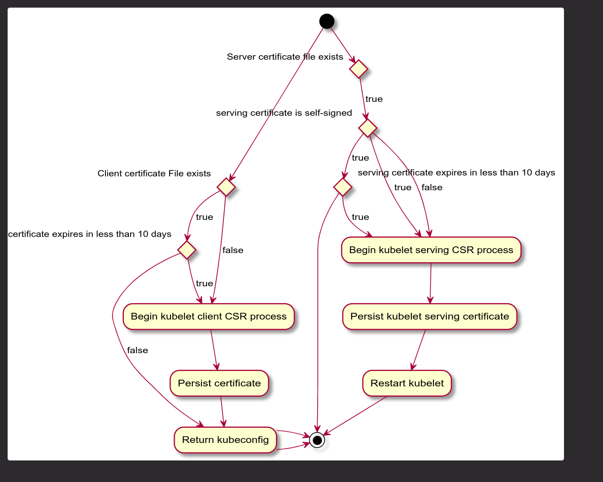

---

title: Cluster API Kubelet Authentication
authors:
  - "@randomvariable"
  - "@yastij"
reviewers:
  - TBD
creation-date: 2021-02-22
last-updated: 2021-02-22
status: implementable
see-also:
  - "/docs/proposals/20210222-cluster-api-node-bootstrapper.md"
replaces:
superseded-by:

---

# Cluster API Kubelet Authentication


## Table of Contents

A table of contents is helpful for quickly jumping to sections of a proposal and for highlighting
any additional information provided beyond the standard proposal template.
[Tools for generating](https://github.com/ekalinin/github-markdown-toc) a table of contents from markdown are available.

- [Title](#title)
  - [Table of Contents](#table-of-contents)
  - [Glossary](#glossary)
  - [Summary](#summary)
  - [Motivation](#motivation)
    - [Goals](#goals)
    - [Non-Goals/Future Work](#non-goalsfuture-work)
  - [Proposal](#proposal)
    - [User Stories](#user-stories)
      - [Story 1](#story-1)
      - [Story 2](#story-2)
    - [Requirements (Optional)](#requirements-optional)
      - [Functional Requirements](#functional-requirements)
        - [FR1](#fr1)
        - [FR2](#fr2)
      - [Non-Functional Requirements](#non-functional-requirements)
        - [NFR1](#nfr1)
        - [NFR2](#nfr2)
    - [Implementation Details/Notes/Constraints](#implementation-detailsnotesconstraints)
    - [Security Model](#security-model)
    - [Risks and Mitigations](#risks-and-mitigations)
  - [Alternatives](#alternatives)
  - [Upgrade Strategy](#upgrade-strategy)
  - [Additional Details](#additional-details)
    - [Test Plan [optional]](#test-plan-optional)
    - [Graduation Criteria [optional]](#graduation-criteria-optional)
    - [Version Skew Strategy [optional]](#version-skew-strategy-optional)
  - [Implementation History](#implementation-history)

## Glossary


- **OID:** Object Identifier defined by the International Telecommunications Union and used in PKI to identify attributes on certificates.

- **PKI:** Public Key Infrastructure

- **TPM:** Trusted Platform Module (TPM) is a specification defined by the Trusted Computing Group (TCG) that allows hosts to attest to their identity via PKI and a secure crypto-processor which may either be a separate chip, built into the CPU or a virtual device provided by the hypervisor.


## Summary

This proposal outlines a method to secure node registration within Cluster API, to solve 3 primary problems:
- Solve a class of attacks involving node impersonation allowing an attacker to access secrets and volumes they shouldn’t by using hardware attestation of node identity.
- Prevent token reuse in MachinePools where the token cannot be easily rotated.


## Motivation

Cluster API default core components are largely reliant on kubeadm for cluster bootstrapping and node registration. Kubeadm is a platform-agnostic command line tool designed to assist users to bootstrap Kubernetes clusters, and is used as a building block in Cluster API.
Because kubeadm is platform-independent and is intended to provide an “easy path” to cluster bootstrapping,  there are a number of inherent design decisions that limit the overall security of the provisioned cluster:
- Kubeadm uses TLS bootstrapping for node registration, however the default workflow used by Cluster API uses bootstrap token which allow registration as arbitrary node names.
    - When used in this mode, Kubeadm essentially does “client-side validation” to prevent node hijacking, but this does not mean the token cannot be reused by an attacker within the lifetime of the token to perform a hijack.
    - Cluster API cannot scope a token down to a specific node, because bootstrap providers, nor most infrastructure providers know the identity of the node ahead of time.
- Kubeadm sets node labels during bootstrapping, and Cluster API does not do reconciliation of node labels post node deployment.
    - This is helpful because it means the kubelet starts with the labels applied straightaway, preventing a race condition when the Kubernetes schedule may misplace a pod due to a temporarily missing node label.
    - However, again, this allows for potential hijacking, for example, using the kubelet’s credentials to apply a label intended for workloads not using the kubernetes.io/node-restriction-* labels.


### Goals

- Provide a bootstrap mechanism that assures secure node registration
- The node registration 


### Non-Goals/Future Work

- Not to change assumptions around management cluster to workload cluster connectivity
- Solve the protection of initial cluster bootstrap secrets for the control plane nodes (see Node Bootstrapper)

## Proposal
| Component | Location | Description |
| --------- | -------- | ----------- |
| node-attestation-controller     | Part of Cluster API repository, under bootstrap/node/attestation, and imported by Cluster API infra providers for implementation. A generic challenge-response implementation will be included for providers / bare metal without an attestation mechanism.     |   A controller to verify and sign the CSR. This would be typically an importable controller where the infrastructure provider implements the interface with specific code for CSR <expand this> approval and start the controller as part of its main.go or through an independent binary.   |

#### Kubelet authentication plugin


The following sequence diagram shows at a high level how a nodeConfig enables bootstrapping a kubernetes node. This sequence diagram is independent of API definition and alternatives and is relevant in all cases.

We propose a kubelet authentication plugin to be present on the instances, (how the nodeadm CLI made available is out of scope for this proposal), which will be responsible for node registration, as well as certificate rotation. The agent will be made up of two parts:
- A common library vendored from Cluster API which includes the following functionality:
    - Certificate filesystem locking
    - Checking existing certificate validity
    - Certificate signing request generation for both kubernetes client and serving certificates
    - Submission of CSRs to the API server and waiting for approval
- A provider specific implementation for node attestation
    - A provider will only need to implement the generation of the attestation to be included in the CSR and the retrieval of the provider ID to be stored in an X.509 extension attribute.

The behaviour of the authentication plugin will be as follows:


#### Node Attestation

As for the node-attestation-controller, the following interface needs to be implemented by the infrastructure providers:
```go
type ClusterAPISigner interface {
     VerifyClientAttestationData (csr *certificatesv1beta1.CertificateSigningRequest) err
     VerifyServingAttestationData (csr *certificatesv1beta1.CertificateSigningRequest) err
}
```

This enables infrastructure providers to perform infrastructure-specific validation of node attestations (TPM, appended tags by the provider, etc.)

Cluster API is responsible for partially verifying node identity with the following conditions:

- A corresponding machine object exist for the `.spec.Username` (`system:nodes:<nodename>`)
- The Machine state is provisioning
- The kubernetes CSR spec has the needed groups
- The kubernetes CSR spec is limited to needed usages (e.g. client auth)
- The kubernetes CSR spec is limited to needed extensions (e.g. no CA extension)
- Parse the CSR and verify that the CN is the same as .spec.username
- Parse the CSR and verify that the Organization is the same as .spec.Groups
- Parse the CSR and ensure that no SANs are appended for kubelet client certificates

#### CSR format used by nodeadm
We propose the introduction of X.509 extension attributes based 
on those reserved for the Kubernetes GCP cloud provider within Google’s organization ID allocation.

We will request via SIG Architecture or CNCF to apply for an IANA OID registration block for the Kubernetes project.

|  OID Suffix |  Name |  Description |
| -------- | -------- | -------- |
| 2.1.21     | KubernetesNodeProviderIdentifierOID     | An identifier for the machine, should be the same or a derivative of the node provider ID. This is the equivalent of Google’s CloudComputeInstanceIdentifierOID, which we can reuse for a proof of concept (1.3.6.1.4.1.11129.2.1.21). |

#### CSR PEM Blocks


| Block Name |  Description |
| -------- | -------- |
| NODEADM ATTESTATION PROVIDER     | string describing the attestation provider     |
| NODEADM ATTESTATION DATA | the actual attestation data to perform validation on |

#### attestation data

Attestation data will be appended, with any relevant base64 encoded data wrapped with the following header & footer. 

Example CSR:
```
-----BEGIN ATTESTATION DATA-----
S25vd2luZyBtZSBBbGFuIFBhcnRyaWRnZSwga25vd2luZyB5b3UgS3ViZXJuZXRlcyBjbHVzdGVyLCBhaGEh
-----END ATTESTATION DATA-----
```
The format of the attestation block is left to the provider. The Appendix section provides examples.

#### Kubelet serving certificate rotation daemon

The kubelet serving certificate rotation daemon runs as a systemd or windows service manager service on the node. It checks for the existence of the serving certificate files, their validity (e.g. not self signed), or request a new serving certificate. Once the new serving certificate is written, kubelet can be restarted.

#### Core Specification
- Core Cluster API MUST provide the following implementations of CSRs and signers:
    - `cluster.x-k8s.io/kube-apiserver-client-kubelet-insecure` which implement an “Always Allow” type signer that provides equivalent security to Cluster API v1alpha3. This is only to be used for providers where no secure mechanism exists.
    - `cluster.x-k8s.io/kube-apiserver-client-kubelet-tpm` and `cluster-x-k8s-io/kubelet-serving-tpm`
        - Will implement TPM-based certificate signers and requesters based on the cloud-provider-gcp implementation.
        - However, since the mechanism for retrieving endorsement keys varies across platforms, the TPM signer will additionally require a provider specific mechanism to provide the TPM Endorsement Key.

#### Provider Specification

#### All providers
- All providers MUST insert a ProviderID within the KubernetesNodeProviderIdentifierOID extension attribute of the CSR
- All signer names MUST be filled in by the provider’s controller in InfraCluster.Status.KubeletClientCertificateSigner and InfraCluster.Status.KubeletServingCertificateSigner

#### Insecure providers
- An insecure provider CANNOT implement certificate rotation or kubelet serving certificate signing
- InfraCluster.Status.KubeletClientCertificateSigner MUST be set to cluster.x-k8s.io/kube-apiserver-client-kubelet-insecure
- An insecure provider MUST use the cluster.x-k8s.io/kube-apiserver-client-kubelet-insecure signer/v1alpha4

#### Secure providers
- A secure provider MUST implement certificate rotation and kubelet server certificate signing
- A provider must register signers of:
    - `cluster-x-k8s-io/kube-apiserver-client-kubelet-<provider>/v1alpha4`
    - `cluster-x-k8s-io/kubelet-serving-<provider>/v1alpha4`
- A secure provider MUST implement a secure attestation mechanism, based upon PEM-encoded blocks within the Certificate Signing Request.
- Where a secure provider’s attestation mechanism does not include a nonce or timestamp to protect against replay attacks, the mechanism MUST implement a secondary time-limited attestation (e.g. AWS Instance Identity document + AWS HMACv4 signature).
- A provider’s signer MUST run on the management cluster

#### TPM based providers
- A TPM provider MUST use the following certificate signers
    - `cluster-x-k8s-io/kube-apiserver-client-kubelet-tpm/v1alpha4`
    - `cluster-x-k8s-io/kubelet-serving-tpm/v1alpha4`
- A TPM provider MUST annotate new CSRs as follows:
    - Key: cluster-x-k8s-io/tpm-endorsement-key/v1alpha4
    - Value: Platform-specific endorsement key (e.g., retrieved from GCP Shielded VM API or VMware vCenter)

#### Kubeadm
Since this proposal essentially takes over part of the node registration process from kubeadm, we will require the following changes:
- kubeadm COULD allow opt-out of kubeadm setting up ClusterRoleBindings between the system:nodes group and the `system:certificates.k8s.io:certificatesigningrequests:selfnodeclient` permission, so that certificate renewals must go through re-attestation. However, Cluster API kubeadm control plane provider is able to reconcile the removal of these roles during control plane instantiation.
- Kubeadm COULD allow opt-out of kubeadm setting up the bootstrapper and node groups and bindings.


#### Kubelet authenticator flow

The authenticator will be responsible for both updating the kubelet client and serving certificates.



### User Stories

#### Story 1: machine attestation

A cluster operator has been asked to ensure compliance with NIST SP 800-190 Application Container Security Guide. Hardware countermeasure 4.6 suggests that container platforms should make use of trusted computing. In a Kubernetes context, this would mean providing hardware node attestation wherever possible. Each cloud provider supports different mechanisms for this (see Appendix). (cluster-api/3762

### Requirements (Optional)

The node bootstrapper MUST be able to attest the identity of the machine against a chain of trust provided by the hardware or cloud provider.

### Implementation Details/Notes/Constraints


### Security Model

Document the intended security model for the proposal, including implications
on the Kubernetes RBAC model. Questions you may want to answer include:

* Does this proposal implement security controls or require the need to do so?
  * If so, consider describing the different roles and permissions with tables.
* Are there adequate security warnings where appropriate (see https://adam.shostack.org/ReederEtAl_NEATatMicrosoft.pdf for guidance)?
* Are regex expressions going to be used, and are their appropriate defenses against DOS?
* Is any sensitive data being stored in a secret, and only exists for as long as necessary?

### Risks and Mitigations

There may be additional security risks being introduced in this design. In order to mitigate this, this proposal will be taken to SIG Security and SIG Auth for review **before the beta graduation**.

## Alternatives

#### Implement within the cloud providers instead of Cluster API
Given that there is an existent implementation in cloud-provider-gcp, this could be extended to all of the cloud providers. However, there are some advantages to making Cluster API responsible for kubelet registration:
- Cluster API can create the node resource as part of the CSR approval process and apply the relevant taints, labels and roles up front. The Kubernetes Cloud Provider contract has no understanding of the desired state of a node.
- No changes to the assumptions around connectivity between management and workload clusters are required, neither does the signer need to be included as a static pod during control plane instantiation.

#### Implement as authentication webhook, as per aws-iam-authenticator (Amazon EKS)
If attestation was implemented as an authentication webhook, it would be in the critical path for all token-based authentication against the API server. It would also additionally be needed to be set up at workload cluster instantiation via a static pod and API server start up.


## Upgrade Strategy

for the upgrade strategy please refer to the Cluster API node bootstrapper proposal.

## Additional Details

### Test Plan [optional]

- E2E tests to be added to AWS, vSphere and Azure providers as each provider implements the signer
- E2E tests to be added for the insecure signers for use with CAPD.
Upgrade tests from latest minor release to latest main branch of Kubernetes 


### Graduation Criteria [optional]

#### Graduation to beta
- E2E tests testing upgrades to latest main branch of Kubernetes are required such that Cluster API can make appropriate changes to node registration if kubelet or kubeadm behaviour changes.

- Security review by SIG Auth and SIG Security
#### Graduation to GA
- Beta for 2 releases
- Optionally, external security review of the combined Cluster API and kubeadm model.


### Version Skew Strategy [optional]

There shouldn’t be any version skew issues between nodeadm  and the bootstrapper, as the only interaction between the two is through the CSR API.
Any changes to the attestation data should be handled in a backward compatible manner by the infrastructure provider when implementing the interface used by the node-attestation-controller, by making sure it's able to convert an older attestation format to a newer one.


## Implementation History

- [ ] MM/DD/YYYY: Proposed idea in an issue or [community meeting]
- [ ] MM/DD/YYYY: Compile a Google Doc following the CAEP template (link here)
- [ ] MM/DD/YYYY: First round of feedback from community
- [ ] MM/DD/YYYY: Present proposal at a [community meeting]
- [ ] MM/DD/YYYY: Open proposal PR

<!-- Links -->
[community meeting]: https://docs.google.com/document/d/1Ys-DOR5UsgbMEeciuG0HOgDQc8kZsaWIWJeKJ1-UfbY
