# Refinement test corpus — specification

The Cluster API formal-modelling work spans four CAPI controller
domains plus the controller-runtime substrate they share, with
50 catalogued failure modes (FM-1..FM-50). This document sets
the scope, prioritisation, and method for the corpus.

Failure-mode coverage by domain:

| Domain | FM range | Spec module(s) |
|---|---|---|
| KCP control-plane lifecycle | FM-1..FM-24, FM-31, FM-32, FM-34, FM-37 | `Lifecycle.qnt` + companions |
| Self-hosted topology | FM-35 | `SelfHosted.qnt`, `Lifecycle.multicluster.qnt` |
| Worker MachineSet preflight | FM-33 | `MachineSetPreflight.qnt` |
| ClusterTopology + runtime extensions | FM-39, FM-40, FM-41 | `Topology.qnt` |
| In-place machine updates | FM-42, FM-43, FM-44 | `InPlaceUpdate.qnt` |
| controller-runtime substrate | FM-45, FM-46, FM-47 | `ControllerRuntime.qnt` |
| End-to-end cluster lifecycle | FM-48, FM-49, FM-50 | `ClusterE2E.qnt` |

Three additional refinement modules
(`TopologyRefined.qnt`, `InPlaceUpdateRefined.qnt`,
`MachineSetPreflightRefined.qnt`) compose abstract specs onto
the controller-runtime substrate and verify that every abstract
safety invariant survives multi-worker semantics.

The MoSCoW prioritisation below ranks each FM by operational
priority. The classes (Must / Should / Could / Won't) refer to
verification effort, not severity — every Must-row has at least
one TLC reachability or Apalache hopelessness verdict; every
Could-row has a Quint init landed.

## 1. MoSCoW prioritisation

### Must

The corpus is incomplete without these.

| FM | Class | Why MUST | Status |
|---|---|---|---|
| FM-1 | KCP-BUG | The modelled scenario; model-detected; upstream cluster-api#13221 | TLC-proven (FM-1 invariants); deterministic run; no e2e yet |
| FM-2 | EXOGENOUS | Apalache hopelessness proven; **e2e PASSES on CAPD** | Apalache + e2e |
| FM-3 | EXOGENOUS | Apalache proven; upstream cluster-api#8465 | Apalache |
| FM-8 | KCP-BUG | The condition-projection regression that hides the production diagnostic; upstream cluster-api#11826 surfaces the broader gap | Quint counterexample |
| FM-13 | EXOGENOUS | LB outage; Apalache proven | Apalache |
| FM-16 | EXOGENOUS | 1-node total loss; Apalache proven via RestoreClusterFromSnapshot | Apalache |

### Should

Verifiable in the same harness; high operational value.

| FM | Class | Why SHOULD | Status |
|---|---|---|---|
| FM-11 | KCP-BUG (latent) | Invalid kubelet config flips Machine to UnhealthyMachine; remediation must succeed | TLC reachable |
| FM-12 | KCP-BUG (latent) | Etcd join times out; KCP must detect JoinFailed and recreate | TLC reachable |
| FM-14 | KCP-BUG (latent) | Kubelet up but Node never registers; KCP must detect NodeRef-less voter | TLC reachable |
| FM-15 | TRANSIENT | Upgrade in flight; rolling update must complete | TLC reachable |
| FM-17 | KCP-BUG | Kubeadm misconfig at join; KCP must recover via DeleteFailedMachine | Quint init landed |
| FM-18 | TRANSIENT | Concurrent scale-up + remediation; serialisation works | Quint init landed |
| FM-19 | TRANSIENT | apiserver restart relist storm; cluster recovers without churn | Quint init landed |
| FM-20 | KCP-BUG (design gap) | Upgrade rollback mid-flight; KCP must converge to mixed-template state | Quint init landed |
| FM-21 | TRANSIENT | 5-node loses 2 voters concurrently — quorum still met | Quint init landed |
| FM-23 | KCP-BUG (latent) | Drain stuck on PDB; KCP must time out drain and force-delete | Quint init landed |
| FM-24 | TRANSIENT | etcd defrag pause; spurious EtcdMemberHealthy=Unknown; KCP must wait | Quint init landed |

### Could

Worthwhile but lower operational priority.

| FM | Class | Why COULD |
|---|---|---|
| FM-4 | TRANSIENT | Promote-before-NodeRef window — self-resolving; documented for completeness |
| FM-5 | KCP-BUG (latent) | MHC observation stuck on NoCorrespondingMember |
| FM-6 | TRANSIENT | Etcd leader vacancy after term advance |
| FM-7 | TRANSIENT | Concurrent remediation serialised by `Remediation.tla` |
| FM-10 | TRANSIENT | Stale health rollup |
| FM-22 | KCP-BUG (design gap) | Single-node scale-up race |
| FM-31 | KCP-DESIGN-GAP | Surface custom Node conditions on Machine without MHC remediation |
| FM-32 | TRANSIENT | Webhook rotation gap (cert-manager#10522) |
| FM-33 | KCP-DESIGN-GAP (closed) | Worker MachineSet preflight gating; verified in `specs/MachineSetPreflight.qnt` (cluster-api#11117) |
| FM-34 | KCP-BUG (latent) | Stale MHC cluster-cache during apiserver restart |
| FM-39 | MODELLING (closed) | Multi-step upgrade hook ordering; verified in `specs/Topology.qnt` |
| FM-40 | MODELLING (closed) | BeforeClusterUpgrade annotation gates CP pickup; verified in `specs/Topology.qnt` |
| FM-41 | MODELLING (closed) | AfterClusterUpgrade fires only at full quiescence; verified in `specs/Topology.qnt` |
| FM-42 | MODELLING (closed) | In-place admitted before CanUpdateMachineSet returns yes; verified in `specs/InPlaceUpdate.qnt` |
| FM-43 | MODELLING (closed) | UpdateMachine hook idempotence (full retry-loop modelled); verified in `specs/InPlaceUpdate.qnt` |
| FM-44 | MODELLING (closed) | Multi-extension fast-failure for in-place updates; verified in `specs/InPlaceUpdate.qnt` |
| FM-45 | MODELLING (closed) | Per-key reconcile serialisation under multi-worker (controller-runtime substrate); verified in `specs/ControllerRuntime.qnt` + 3 refinement modules |
| FM-46 | MODELLING (closed) | TerminalError suppresses requeue (controller-runtime substrate); verified in `specs/ControllerRuntime.qnt` |
| FM-47 | MODELLING (closed) | Cache lags API server (controller-runtime substrate); verified in `specs/ControllerRuntime.qnt` |
| FM-48 | MODELLING (closed) | KCP must not create CP Machines before InfraCluster ready (E2E ordering); verified in `specs/ClusterE2E.qnt` |
| FM-49 | MODELLING (closed) | MD must not create workers before ControlPlaneInitialized (E2E ordering); verified in `specs/ClusterE2E.qnt` |
| FM-50 | MODELLING (closed) | ControlPlaneEndpoint monotonicity (E2E invariant); verified in `specs/ClusterE2E.qnt` |
| FM-37 | KCP-BUG (latent) | Lifecycle hook skipped when CP unavailable |

### Won't

Out of scope for this round.

| FM | Class | Why WON'T |
|---|---|---|
| FM-9 | MODEL-INCOMPLETE | Fairness annotations require a 60-conjunct expansion that is mechanical but tedious; deferred |
| FM-25 — etcd cert rotation | EXOGENOUS | Provider-specific PKI choreography; out of CAPI core scope |
| FM-26 — workload apiserver TLS expiry | EXOGENOUS | Same |
| FM-35 — self-hosted upgrade deadlock | MODEL-EXPANSION | Requires modelling management ↔ workload as separate clusters |
| FM-36 — drain blocked by PDB | OVERLAPS-FM-23 | Subsumed by FM-23 |
| FM-38..FM-40 — provider-specific | OUT-OF-SCOPE | Infrastructure-layer faults already abstracted via Partition / NodeNeverJoins |

## 2. Feature model

The corpus is the cross product of three orthogonal feature
axes. Each scenario in `Lifecycle.qnt` is a concrete coordinate
in this space.

```mermaid
graph TB
  Root((Lifecycle Test))

  Root --> Topology
  Root --> FaultClass
  Root --> Verification

  Topology[[Topology<br/>mandatory, alternative]]
  Topology --> SingleNode[1-node<br/>singleNodeInit]
  Topology --> ThreeNode[3-node<br/>threeNodeInit · primary]
  Topology --> FiveNode[5-node<br/>fiveNodeInit]

  FaultClass[[Fault class<br/>mandatory, OR]]
  FaultClass --> JoinFault[Kubeadm-join<br/>FM-1, FM-12, FM-17]
  FaultClass --> ConditionFault[Health-condition<br/>FM-5, FM-8, FM-10, FM-19, FM-24]
  FaultClass --> NetworkFault[Network<br/>FM-3, FM-13, FM-14]
  FaultClass --> KubeletFault[Kubelet / Node<br/>FM-11, FM-14, FM-17]
  FaultClass --> RemediationFault[Remediation gate<br/>FM-1, FM-2, FM-7, FM-18, FM-23]
  FaultClass --> UpgradeFault[Upgrade<br/>FM-15, FM-20]
  FaultClass --> TotalLoss[Total loss<br/>FM-2, FM-16]

  Verification[[Verification<br/>mandatory, OR]]
  Verification --> RandomQuint[Quint random walk<br/>quint run --invariant]
  Verification --> ExhaustiveTLC[TLC exhaustive<br/>quint verify --backend=tlc]
  Verification --> SymbolicApalache[Apalache symbolic<br/>quint verify --backend=apalache]
  Verification --> CapdE2E[CAPD e2e<br/>docker-pause + Consistently]
  Verification --> Lean[Lean proof<br/>parametric refinement]
```



Mandatory means every scenario must pick at least one in that
group. Alternative means exactly one. OR means at least one.
The combinations explored so far:

  - 3-node × Network × Apalache (FM-3 partition, FM-13 LB)
  - 3-node × Total-loss × Apalache (FM-2 both unhealthy)
  - 1-node × Total-loss × Apalache (FM-16)
  - 3-node × Remediation-gate × TLC (FM-1 FM-1 invariants)
  - 3-node × Network × CAPD-e2e (**FM-2, PASSED**)
  - 5-node × Join-fault × TLC (fiveNodeStuckLearnerInit)

## 3. Methods

### Quint as the source of truth

Every FM has a Quint init action in `specs/Lifecycle.qnt`. The
init constructs the post-fault state directly. The naming
convention is `<modeName>Init` for the bad-state init and
`<modeName>Scenario` for a chained-action run that produces the
same state by composition (used to verify the action sequence
itself).

### Verification cascade

Each FM is verified in increasing rigour:

1. **`quint run --invariant=AllSafetyInvariants`** at 30 steps × 2000 samples — catches obvious violations cheaply (~150ms).
2. **TLC exhaustive** at max-steps=4..8 with `step` (recovery enabled) to confirm convergence is reachable.
3. **Apalache symbolic** at max-steps=4 with `stepNoRecovery` to prove non-convergence without recovery (the load-bearing claim).
4. **CAPD e2e** for the cases CAPD can simulate (per `dst-methodology.md` §6 capability matrix).

Steps 1 and 2 are routine. Step 3 takes 20–80 s per FM. Step 4
takes 15–25 minutes per FM and only viable for a handful.

### LSP-grounded refinement

`formal/lsp-grounding.md` ensures every Quint action's
abstraction-mapping row points at a gopls-resolvable Go entry.
The CI gate in `scripts/verify-formal.sh` is the drift detector:
abstraction-mapping rows whose Go references no longer resolve
flag the model as out-of-date.

### CAPD-side fault injection

`formal/dst-methodology.md` is the catalogue of how each
abstract fault action maps to a Docker primitive. FM-2's e2e
spec is the working example: `docker pause` two CP node
containers, `Consistently` the Machine set is unchanged,
`docker unpause`, `Consistently` no spurious churn.

## 4. Concrete scope of the test suite

### Quint specs (status: COMPLETE for the Must / Should tier)

```
formal/specs/
├── EtcdMembership.qnt        — per-module spec
├── KubeadmJoin.qnt
├── KCPReconcile.qnt
├── MachineHealthCheck.qnt
├── Composition.qnt           — cross-module invariant statements
├── Lifecycle.qnt             — monolithic composition (authoritative)
└── Remediation.tla           — TLA+ scheduler shape
```

`Lifecycle.qnt` has 22 named init actions covering every Must
and Should FM, plus the eight FM-17..FM-24 added in this round.

### CAPD e2e specs (status: PARTIAL)

```
test/e2e/
├── fm2_quorum_loss.go        — FM-2, PASSED
├── fm2_quorum_loss_test.go
└── (FM-3, FM-13, FM-15 — TBD; templates in dst-methodology.md)
```

The `dst-methodology.md` document gives the docker-primitive
mapping for every Must / Should FM. Implementing each is ~150
LoC of Go and ~5 min of e2e runtime; the bottleneck is wall
time, not author effort.

### Verification artefacts (status: ON-TRACK)

| Artefact | What | Status |
|---|---|---|
| `failure-modes.md` | 24 catalogued FMs with TLC/Apalache verdicts where applicable | maintained per commit |
| `issue-corpus.md` | Per-FM doc entry — title, FM ref, severity, repro shape, suggested remediation | landed in this round |
| `lsp-grounding.md` | Every Quint action ↔ Go entry point | landed |
| `dst-methodology.md` | Fault catalogue + e2e template | landed |
| `upstream-issues-research.md` | GitHub-issue research | landed |
| `counterexample-log.md` | Open spec violations awaiting fix | maintained per commit |

## 5. Definition of done

A failure mode is "done" when:

1. It has a named `*Init` action in `Lifecycle.qnt`.
2. It is in `failure-modes.md` with a classification (KCP-BUG,
   EXOGENOUS, TRANSIENT, MODEL-INCOMPLETE).
3. Its load-bearing recovery action (where one exists) is
   modelled — RemoveStuckLearner, DeleteFailedMachine,
   HealEtcdReachability, HealLb, RestoreNodeReachability,
   RestoreClusterFromSnapshot, or future additions.
4. Either:
   * Apalache has proven `not(HealthyControlPlane)` under
     `stepNoRecovery` from the init (hopelessness proof for
     EXOGENOUS modes), OR
   * TLC has reached `HealthyControlPlane` under `step` (recovery
     proof for KCP-BUG / TRANSIENT modes).
5. Its row in `lsp-grounding.md` (if it touches a Go entry point)
   resolves.
6. Its row in `failure-modes.md` cross-references either
   `issue-corpus.md` (KCP-BUG) or the upstream issue
   (EXOGENOUS / external).

Six FMs (FM-1, FM-2, FM-3, FM-8, FM-13, FM-16) are fully done
under this definition. The other eighteen are at varying stages,
documented per row in `failure-modes.md`.
